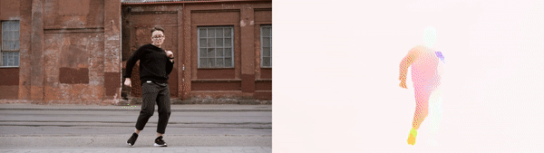

# RAFT-opticalflow-runwayML
> Recurrent All Pairs Field Transforms for Optical Flow: on RunwayML

[](https://app.runwayml.com/models/mayukhmainak2000/OpticalFlow-with-RAFT)



## Install and run it from runwayML [here](https://app.runwayml.com/models/mayukhmainak2000/OpticalFlow-with-RAFT)

Or if you're feeling crafty:
### Create a local dev environment:

1. Clone the repo

    `https://github.com/Mayukhdeb/RAFT-opticalflow-runwayML.git`

2. Navigate into the repo

    `cd RAFT-opticalflow-runwayML`

3. Make a virtualenv 

    ```
    python3 -m venv your_env_name
    source your_env_name/bin/activate
    ```

4. Install requirements

    `pip install -r requirements.txt`

5. Run the entrypoint script

    `python runway_model.py`

    Which should give an output like: 

    ```
    Initializing model...
    Model initialized (0.04s)
    Starting model server at http://0.0.0.0:9000...
    ```
6. Open a new workspace in [RunwayML](https://learn.runwayml.com/#/getting-started/installation) and press `connect`. Make sure your localhost port matches the one given by the server script (in this case it's `9000`)

7. Select the image/video you want to work with and have fun!